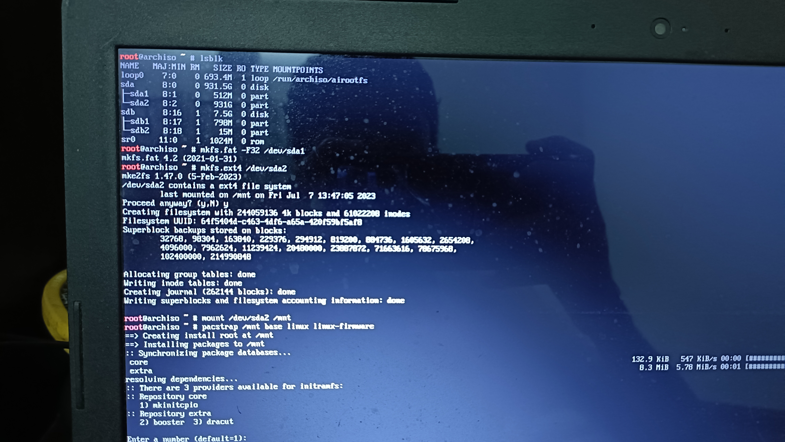
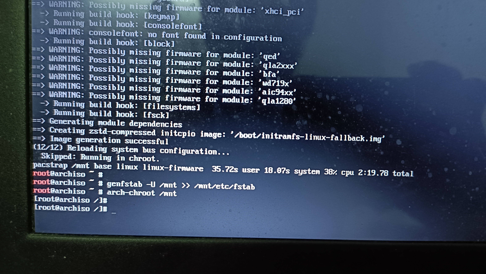
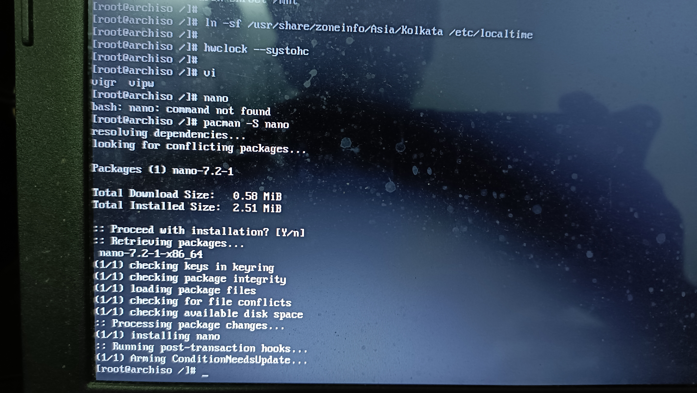
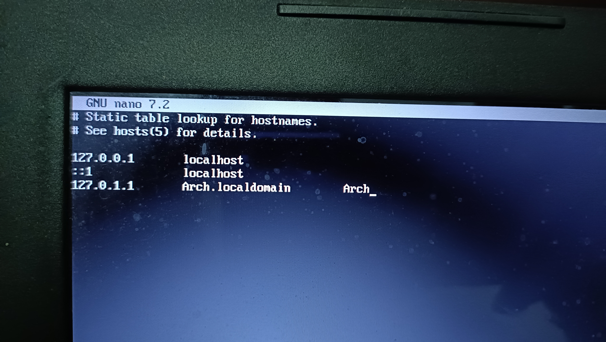
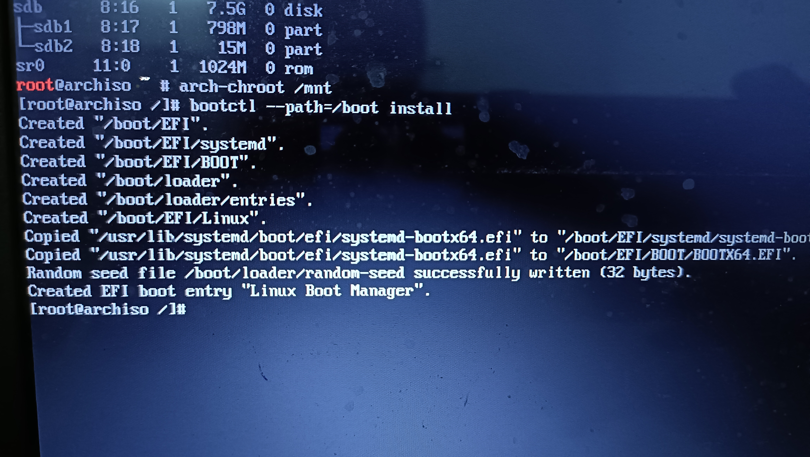

## What is Arch Linux?


_Arch Linux_ is an independent **GNU/Linux** distribution that embraces the _KISS_ philosophy - Keep It Simple, Stupid. It is a **rolling-release** Linux distro (short for _distribution_), meaning software receive updates almost as soon as developers release them.

The **kernel** on Arch Linux is the latest among Linux distros. The biggest advantages of using Arch include:

* access to a vast source of user-contributed packages (AUR)
* access to the latest builds of most software
* fast update times, no need to wait for distro upgrades to complete fully

Let's install Arch Linux on our computers!

## Preparation of installation medium

1) Find a spare USB drive (capable of storing 8 or more GB data). Ensure that it doesn't contain any valuable data.

2) Download the ISO file for Arch Linux from [this URL](https://in-mirror.garudalinux.org/archlinux/iso/2023.07.01/archlinux-x86_64.iso).

3) Download and install the Balena Etcher tool, used to flash OS ArchInstall/images onto the USB drive. 

4) Click on `Select image`, choose the ISO file downloaded recently, then click on `Select drive`. Choose the USB device you want to flash to. 

5) Select `Flash!`. This **formats** your USB device, removing all existing data. 2 partitions are created in the USB drive, of which *one* contains the ISO file.

Balena Etcher makes this device bootable. This means you can boot directly from this device, making use of RAM to store **temporary** files in the _live environment_.

Congratulations! You've created a working Linux "disk" that can be used to install Linux on _various_ computers!

## Installation

1) Power off the computer once the ISO image has been flashed to the USB drive.

2) Plug the USB drive into a port provided on the side of the computer.

3) While booting, press either of the following keys:

    `Esc`, `F1`, `F2`, `F8`, `F9`, `F10`, `F12`, etc.

    The exact key varies across devices, so trial-and-error is needed to boot into the **UEFI/BIOS** menu.

4) In the interface, **disable `Secure Boot`**. Finding this option takes some time, and varies across devices.

5) Power off the device after disabling Secure Boot. 

6) Boot the device back on, while pressing the same key used previously to access the BIOS/UEFI menu. Select the device from the **boot devices** dropdown menu. The entry usually contains something like "SanDisk", the name of the manufacturer, etc.

7) After the selection, messages about services would appear on the screen. A "Welcome to Arch Linux!" message indicates that the device contains a valid image; after some time, a prompt saying `root@archiso` should appear.


8) **Connecting to Internet (Wi-fi)**:

Use the `iwctl` tool provided by the _iNet Wireless Daemon_ (IWD) package:

```bash
iwctl
```

The prompt should now change to `[iwd]#`. To list out the devices, type:

```bash
device list
```
Typically, it's `wlan0` (wireless LAN 0). Scan for networks managed by the interface *wlan0* with:

```bash
station wlan0 scan # to initialize a scan for networks
station wlan0 get-networks # to display available networks
```
Connect to the network named *NAME* with:
```bash
station wlan0 connect NAME
```


`iwctl` should ask for the network password. Once provided correctly, Internet connection is established.

Press `Ctrl-d` to exit IWD.

To test network connectivity, type:
```bash
ping google.com
```

If network requests are sent and received, network connection has been established successfully.

9) To synchronise the system clock with an NTP server, type:
```bash
timedatectl set-ntp true
```

---

10) **Partitioning**

This device has only a 1 Tb (actually, 931.5 Gb) hard-drive disk (_HDD_). The *bootloader*, *home* and *root* partitions lie on the same disk. 

Partitioning layouts will vary across devices, and based on the use case too. If your computer has an _SSD_, allocate free space (from within Windows' Disk Management, for example) in both the SSD and the HDD. 

If you want Linux and Windows to boot up quickly (in case you dual-boot Linux and Windows), make space (512 Mb) in the SSD for the Linux bootloader, and space in the HDD for the main root partition storage ([refer URL](https://itsfoss.com/dual-boot-hdd-ssd/)).

**BE VERY CAREFUL WHILE PARTITIONING. MISTAKES CAN'T BE UNDONE.**

In this device, I've dedicated the entire HDD to Arch Linux (not dual-booting). 

So,

931.5 Gb $\rightarrow $ 931 Gb (ROOT) + 0.5 Gb (512 Mb, BOOT).

`/dev/sda` is the entire hard drive. If you have an SSD, it **might** be `/dev/sda` or `/dev/sdb`, and the hard drive will be the other device. Identify based on storage size.

Use the command `lsblk` to verify all storage devices. Use `cfdisk DEVICE` to check the partitions per device.



You can observe that `sda1` is the _EFI bootloader partition_, and `sda2` is the root partition, based on their sizes. Ignore the device listed at the end (in this case, `sdb`), as it's usually the details of the USB drive.

To make partitions,

```bash
sudo cfdisk /dev/sda # for partitioning hard drive in my case
```

Navigate to the `Free space` entry using arrow keys. In the free space allocated previously, choose `New` (press Enter) to create a partition. Press `Enter`, leaving the default "Partition size" mentioned. Press the `Right arrow` key to navigate to _[Type]_, and choose _Linux filesystem_.

Based on where you allocated space for the boot partition on Windows (on `/dev/sda` or on `/dev/sdb`), repeat the process to create an `UEFI/BIOS` partition. Choose _EFI System_ to create one for a UEFI system, and _BIOS boot_ to create a BIOS boot partition.

In this case, the root and _EFI_ boot partitions have  been created on the same `/dev/sda` device.


---

11) Formatting the created partitions

You've created root and boot partitions. They must be formatted with appropriate filesystems for them to serve their purpose. 

To format them correctly:

```bash
mkfs.fat -F32 /dev/sda1
```
Replace `sda1` with the correct boot partition/device.

```bash
mkfs.ext4 /dev/sda2
```
Again, replace `sda2` with the correct root partition/device.

---

12) Mounting the freshly minted filesystems

```bash
mkdir -p /mnt
```
To mount the file systems in a directory `mnt` in `/`.
It's to be created, as it doesn't exist.

This directory, short for _mount_, is a "mountpoint" for external storage devices on Linux systems.

```bash
mount /dev/sda2 /mnt # mounting root partition (/)
mount /dev/sda1 /mnt/boot # mounting boot partition (/boot)
```

As above, replace `sda1` and `sda2` with the correct filesystems on your computer.

---

13) To create a new _minimal_ system from scratch, with the **linux** kernel,

```bash
pacstrap /mnt base linux linux-firmware
```

This step takes some time, as it installs the kernel, essential packages and firmware. Press `Enter` when asked to enter numbers. Feel free to walk away for a cup of coffee after this ;)

---

14) Generating the filesystem table

```bash
genfstab -U /mnt >> /mnt/etc/fstab
```

This creates a file system table, and records the output in `/etc/fstab` on the installed OS. This file lets the OS know which device to mount automatically during boot.



---

15) Post-installation steps

**Congrats!! You've installed _Arch Linux_ on your computer!**

To access the installed system, from the live USB medium, without booting the OS,

```bash
arch-chroot /mnt # changing root directory
```

What you can access now is the installed OS' shell. Commands run directly on the OS. The prompt should change to `[root@archiso /]# `.

**To set timezone info**,

```bash
ln -sf /usr/share/zoneinfo/REGION/CITY /etc/localtime 
```

If you live in India, type:

```bash
ln -sf /usr/share/zoneinfo/Asia/Kolkata /etc/localtime # irrespective of Indian city
```

If you're unsure about the choice of cities available, list the contents of the `/usr/share/zoneinfo/` and `/usr/share/zoneinfo/<REGION>` directories:

```bash
ls /usr/share/zoneinfo
# note the region, such as Asia, America, etc.
ls /usr/share/zoneinfo/<REGION>/ # REGION is from above.
# note the city
```



**To synchronise the hardware and software clocks**,

```bash
hwclock --systohc
```

You probably do not have any text editor installed. Install a text-based one, called Nano, using the package manager, _Pacman_:

```bash
pacman -S nano
```
Type `Y` or `Enter` to confirm the installation.

You can now use this editor to edit files in the following steps.

**To configure locale settings**,

```bash
nano /etc/locale.conf
```
Uncomment the first line starting with _en\_US.UTF8_ (remove the pound sign at the start of the line), to set your locale to "US English".


Press `Ctrl-S` to save, `Ctrl-x` to exit Nano.

Type this to generate the new locale:

```bash
locale-gen
```

**To map IP addresses to domains**, edit the `/etc/hosts` file.

Set a hostname with:

```bash
hostnamectl set-hostname NAME
```
Replace NAME with a unique hostname for the device.

Update to the following:

```text
127.0.0.1   localhost
::1         localhost
127.0.1.1   NAME.localdomain    NAME
```

Replace NAME with the hostname set earlier using `hostnamectl`.


In this case, `Arch` is my device's hostname.

---

16. User creation

Firstly, install the _sudo_ program to give a normal user the ability to run commands as the _root_ user.
Type:

```bash
pacman -S sudo # press Enter when asked for confirmation
```

**IMPORTANT**: Add a password for the root user,

```bash
passwd
```

Enter a strong and complicated password. Forgetting this password would be **catastrophic**. The password _would not be visible_ when typing on the screen (as a safety measure).

It is recommended to create an **privileged** user, rather than perform all tasks as _root_ (**UNSAFE!**).

To add a user, say `USER`, type:

```bash
useradd USER # replace USER with something else
passwd USER # to set admin password for USER
```

By default, the user would not be allowed to run commands as root using _sudo_. For this to happen, edit the `/etc/sudoers` file using Nano:

```bash
nano /etc/sudoers
```

Uncomment the line saying:

```conf
%wheel ALL=(ALL:ALL) ALL
```


You must now add your user to the _wheel_ users group. 
Type:

```bash
sudo usermod -aG wheel USER
```
Replace _USER_ with the user you just created.

Now you have a regular user who can execute commands as _root_ using `sudo`.

---

17) Installing the bootloader, wireless network tools

Install packages using _Pacman_:
```bash
pacman -S efibootmgr network-manager-applet wireless_tools wpa_supplicant dialog os-prober mtools dosfstools base-devel linux-headers
```

Once the installation finishes, you can proceed to install the bootloader.

```bash
bootctl --path=/boot install
```

Finally, add these lines to `/boot/loader/loader.conf`:

Edit using
```bash
sudo nano /boot/loader/loader.conf
```

```text
timeout 3
default arch-*
```
and to `/boot/loader/entries/arch.conf`:

```bash
sudo nano /boot/loader/entries/arch.conf
```
```text
title   Arch Linux
linux   /vmlinuz-linux
initrd  /initramfs-linux.img
options root=/dev/sda2 rw
```

Replace `sda2` with the root partition device installed to.



Ensure that the networking service autostarts, using `systemctl`:

```bash
sudo systemctl enable NetworkManager
```

**Basic installation is over!!**

You can now _unmount_ the installation media and shut down the computer:

```bash
umount -l /mnt
shutdown now
```

You can use _Arch Linux_ from the next time you boot up the computer!!

---

PS: If you haven't figured it out until now, [I use Arch, BTW!](https://knowyourmeme.com/memes/btw-i-use-arch)
