--- 
title: Configuring Emacs
published: 2024-04-21
description: The first steps of writing your own Emacs config
tags: [Emacs]
category: Emacs
draft: false

---

# Introduction

------------------------------------------------------------------------

This article aims to provide the **essential** steps needed to configure
[GNU Emacs](https://gnu.org/emacs) on your own to make it a functional
**IDE**. This config is inspired by [Doom Emacs](https://github.com/doomemacs/doomemacs), a *configuration framework* for GNU Emacs (Emacs in short).

Emacs is configured via a language called [Emacs
Lisp](https://en.wikipedia.org/wiki/Emacs_Lisp). It allows Emacs to be
customised to *extreme* levels. The Emacs Lisp code blocks These blocks
should be placed in the file located in **\~/.emacs.d/init.el/** (or on
Emacs 29, **\~/.config/emacs/init.el**)on Linux. Windows users may refer
to [GNU's
manual](https://www.gnu.org/software/emacs/manual/html_node/efaq-w32/Location-of-init-file.html).

This config is **declarative**, and the Emacs Lisp packages specified in
this file should install automatically after installation.

------------------------------------------------------------------------

# Package management

------------------------------------------------------------------------

## Setting up the MELPA repository

Adding [MELPA](https://melpa.org) to the package archives so that
packages not in the default *ELPA* repository can be installed.

```lisp 
(require 'package)
(add-to-list 'package-archives '("melpa" . "https://melpa.org/packages/"))
```

## Use-package

[Use-package](https://github.com/jwiegley/use-package) is a
[macro](https://www.gnu.org/software/emacs/manual/html_node/elisp/Macros.html)
that manages package configuration. It uses the built-in *package.el*,
which comes with standard GNU Emacs, as its backend. The code snippet
given below bootstraps Use-package so that it can install and manage
itself.

``` lisp
(unless (package-installed-p 'use-package) (package-install 'use-package)) ; install use-package with package.el
(require 'use-package-ensure)                                              ; ensure that it installs automatically
(setq use-package-always-ensure t)
(require 'use-package)                                                     ; load use-package at Emacs startup
```

------------------------------------------------------------------------

# Generic preferences

------------------------------------------------------------------------

## Faces (font management)

This block configures JetBrains Mono as the default font throughout
Emacs.

``` lisp
(set-face-attribute 'default nil
     :family "JetBrains Mono"
     :height 140
     :weight 'normal
     :width 'normal)

(set-face-attribute 'variable-pitch nil
     :family "JetBrains Mono"
     :height 140
     :weight 'normal
     :width 'normal)

(set-face-attribute 'fixed-pitch nil
     :family "JetBrains Mono"
     :height 140
     :weight 'normal
     :width 'normal)

(add-to-list 'default-frame-alist '(font . "JetBrains Mono 14"))

(set-face-attribute 'font-lock-comment-face nil :slant 'italic)
(set-face-attribute 'font-lock-function-name-face nil :slant 'italic)
(set-face-attribute 'font-lock-variable-name-face nil :slant 'italic)
(set-face-attribute 'font-lock-keyword-face nil :slant 'italic)
```

## Miscellaneous

These are generic *tweaks* that I like better than those in **vanilla**
GNU Emacs.

``` lisp
(setq custom-file "~/.config/emacs/custom.el")
(setq inhibit-splash-screen t) ; disable startup screen
(menu-bar-mode -1)             ; disable the menu bar below the application window
(tool-bar-mode -1)             ; disable the Emacs tool bar 
(scroll-bar-mode -1)           ; disable the scroll bar
(global-visual-line-mode t)    ; disable visual line mode
(auto-save-mode nil)           ; don't auto save files by default
(setq initial-buffer-choice (lambda() (get-buffer "*dashboard*"))) ; so that the Emacsclient window opens up with Dashboard each time 
(buffer-face-mode 1)           ; so that different fonts can be used on different buffers if needed
(setq auto-save-default nil)   ; set the default file location of auto-saved files to NIL
(add-to-list 'load-path (expand-file-name "~/.config/emacs/lisp/"))     ; load all user-defined Emacs Lisp scripts from this directory
(let ((default-directory  "~.config/emacs/lisp/")) (normal-top-level-add-to-load-path '("*")))
(setq use-short-answers t)     ; so that yes/no questions in the minibuffer can be answered using y/n
(setq-default tab-width 4)     ; make default tab spacing 4
(delete-selection-mode 1)      ; select text and automatically overwrite without typing backspace
(setq browse-url-generic-program "xdg-open") ; open URLs in the default web browser (not EWW) using XDG's util
```

------------------------------------------------------------------------

# Package configuration

------------------------------------------------------------------------

Let's use *Use-package* to manage packages **declaratively**. Here are
a few packages I recommend:

## Evil-mode

[Evil](https://github.com/emacs-evil/evil) is an extensible Vim
emulation library for Emacs. It <u>faithfully</u> brings almost
the keybindings</u> of the [Vim](https://github.com/vim/vim) text editor to
Emacs, effectively transforming Emacs into a *modal editor*.

``` lisp
(use-package evil
  :init
  (setq evil-want-keybinding nil)
  (evil-mode 1)

  :config
  (evil-define-key 'normal org-mode-map (kbd "<tab>") #'org-cycle)
  (evil-define-key 'normal org-mode-map (kbd "RET") 'org-enter-maybe-execute-code)
  (evil-set-undo-system 'undo-tree))
(require 'evil-vars)
```

## Doom Modeline

[This](https://github.com/seagle0128/doom-modeline) modeline is the
default one used in Doom Emacs. It's *minimalistic*, and includes
essential features while appearing **unique**.


``` lisp
(use-package doom-modeline
  :init
  (doom-modeline-mode 1)

  :config
  (setq doom-modeline-icon t
  doom-modeline-major-mode-icon t
  doom-modeline-major-mode-color-icon t
  doom-modeline-enable-word-count t
  doom-modeline-buffer-encoding t
  doom-modeline-persp-icon t
  doom-modeline-modal-modern-icon nil
  doom-modeline-persp-name t
  doom-modeline-height 25))
```

## All-the-icons

[This](https://github.com/domtronn/all-the-icons.el) package provides
access to a **vast** set of icons from *Github Octicons*, *FontAwesome*,
etc. They can be used in Vertico, the modeline, Dired buffers, etc.

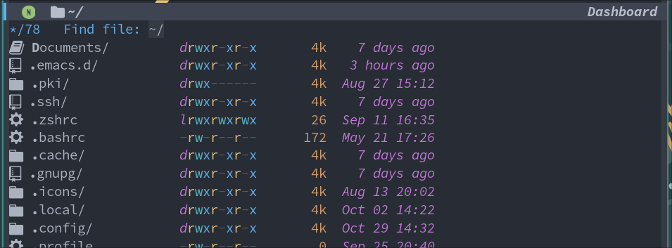

``` lisp
(use-package all-the-icons)
(use-package all-the-icons-completion
  :after (marginalia all-the-icons)
  :hook (marginalia-mode . all-the-icons-completion-marginalia-setup)
  :init
  (all-the-icons-completion-mode))
```

## Atom OneDark theme

I'm a fan of [Atom](https://github.com/atom/atom)'s neat OneDark
colorscheme, so I'm using
[this](https://github.com/jonathanchu/atom-one-dark-theme) theme for
Emacs. This theme appears throughout the screenshots provided below.

``` lisp
(use-package atom-one-dark-theme
  :init
  (load-theme 'atom-one-dark t))
```

## Vertico

[Vertico](https://github.com/minad/vertico), short for VERTical
Interactive COmpletion, improves upon the default *completion* interface
in Emacs by providing a **performant** and **minimalistic** completion
UI. It enhances the *minibuffer* interface used [throughout
Emacs]<u> for completion</u>.

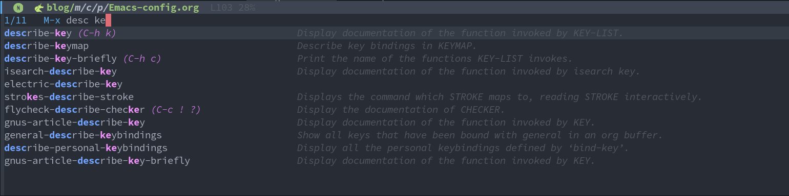

``` lisp
(use-package vertico
  :init
  (vertico-mode 1)
  :hook
  (rfn-eshadow-update-overlay . vertico-directory-tidy) ; when a directory's name is incomplete, delete the name completely in Vertico
  :bind
  (:map vertico-map
  ("RET" . vertico-directory-enter)           ; make Return enter directories
  ("DEL" . vertico-directory-delete-char)     ; make Delete delete characters as well
  ("M-DEL" . vertico-directory-delete-word))  ; delete words easily
  :config
  (setq vertico-count 17)
  (setq completion-styles '(flex))
  (setq completion-category-overrides '((file (styles . (partial-completion))))))
```

## Keybindings - General & Which-key

[General](https://github.com/noctuid/general.el) provides a convenient,
unified way to **create keybindings** in Emacs. It <u>integrates
well</u> with *Evil mode*. The `general-define-key`
function allows **more flexibility** in binding keys, compared to the
standard `define-key` function in GNU Emacs.

[Which-key](https://github.com/justbur/emacs-which-key) is another
package for Emacs that provides a *popup* displaying the **available
keybindings** after a <u>particular sequence</u> of keys has been
typed. It's quite useful in discovering keybindings in *different
modes* and in large keymaps.

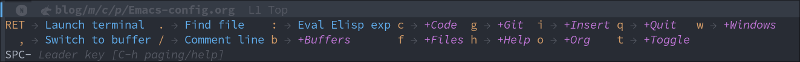

``` lisp
(use-package general
  :init
  (general-evil-setup t))

(use-package which-key
  :init (which-key-mode))
```

**Keybindings**:

``` lisp
(general-define-key
 :states '(normal visual insert emacs)
 :keymaps 'override
 :prefix "SPC"
 :non-normal-prefix "C-SPC"
 ""    '(:ignore t :which-key "Leader key")
 "."   '(find-file :which-key "Find file")
 "/"   '(comment-line :which-key "Comment line")
 ","   '(consult-buffer :which-key "Switch to buffer")
 ":"   '(eval-expression :which-key "Eval Elisp exp")
 "RET" '(vterm-toggle :which-key "Launch terminal ")
 "f"   '(:ignore t :which-key "Files")
 "f c" '(edit-config-file :which-key "Edit Emacs config file")
 "f f" '(consult-find :which-key "Find file")
 "f s" '(save-buffer :which-key "Save file")
 "f d" '(delete-current-buffer-file :which-key "Delete file")
 "f r" '(rename-file :which-key "Rename file")
 "f x" '(write-and-quit :which-key "Save file and quit")
 "q"   '(:ignore t :which-key "Quit")
 "q q" '(save-buffers-kill-terminal :which-key "Quit")
 "b"   '(:ignore t :which-key "Buffers")
 "b k" '(kill-this-buffer :which-key "Kill buffer")
 "b o" '(kill-other-buffers :which-key "Kill other buffers")
 "b x" '(scratch :which-key "Scratch buffer")
 "b s" '(consult-buffer :which-key "Switch to buffer")
 "g"   '(:ignore t :which-key "Git")
 "g g" '(magit-status :which-key "Magit")
 "g d" '(magit-diff-unstaged :which-key "Diff")
 "h"   '(:ignore t :which-key "Help")
 "h f" '(helpful-function :which-key "Functions")
 "h v" '(helpful-variable :which-key "Variables")
 "h k" '(helpful-key :which-key "Keymaps")
 "h b" '(describe-bindings :which-key "Bindings")
 "h h" '(helpful-symbol :which-key "All")
 "h i" '(consult-info :which-key "Info")
 "i"   '(:ignore t :which-key "Insert")
 "i u" '(insert-char :which-key "Unicode character")
 "i n" '(nerd-icons-insert :which-key "Nerd icon")
 "c"   '(:ignore t :which-key "Code")
 "c f" '(evaluate-buffer :which-key "Execute buffer")
 "c e" '(evaluate-region :which-key "Execute selection")
 "t"   '(:ignore t :which-key "Toggle")
 "t c" '(toggle-mc-multiple-cursors :which-key "Multiple cursors")
 "t f" '(toggle-frame-fullscreen :which-key "Fullscreen")
 "t l" '(display-line-numbers-mode :which-key "Line numbers")
 "t s" '(toggle-scroll-bar :which-key "Scroll bar")
 "t p" '(prettify-symbols-mode :which-key "Symbols")
 "t o" '(clear-eros-overlays :which-key "Clear overlays")
 "t n" '(normal-mode :which-key "Normal mode")
 "t d" '(dashboard-open :which-key "Dashboard")
 "t t" '(treemacs :which-key "Treemacs")
 "t r" '(clear-recent-files :which-key "Clear recent files")
 "o"   '(:ignore t :which-key "Org")
 "o h" '(org-html-export-to-html-and-open :which-key "Open Org preview")
 "o c" '(org-babel-remove-result :which-key "Clear Org-Babel execution result")
 "w"   '(:ignore t :which-key "Windows")
 "w c" '(evil-window-delete :which-key "Close window")
 "w h" '(evil-window-left :which-key "Move to left")
 "w l" '(evil-window-right :which-key "Move to right"))
```

``` lisp
(general-define-key
 :states '(visual)
 :keymaps 'override
 :prefix "SPC"
 :non-normal-prefix "C-SPC"
 "/" '(comment-dwim :which-key "Comment region")
 )

(general-define-key
 :states '(normal)
 :keymaps 'override-global-map
 "/" '(consult-line :which-key "Search in buffer")
 "s" '(evil-avy-goto-char-timer :which-key "Hop to"))
```

## Flycheck

[Flycheck](https://www.flycheck.org/en/latest/) is a modern *on-the-fly*
**syntax checking** package for GNU Emacs. It aims to **replace the
classic Flymake**, part of GNU Emacs. It calls upon *externally
installed* **syntax** and **linting checkers** to check code as you
write it.

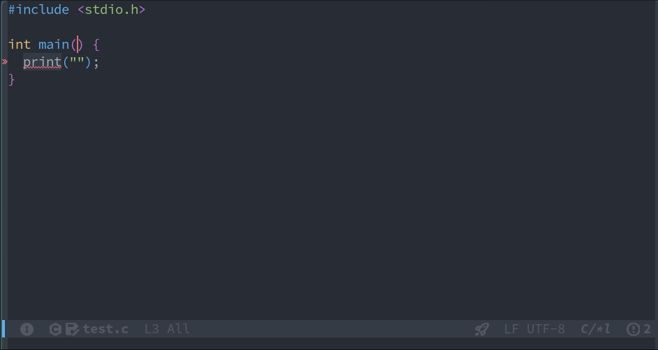

``` lisp
(use-package flycheck
  :init
  (global-flycheck-mode))
```

## Magit

[Magit](https://magit.vc) is an interface to the popular **Git** version
control system. Implemented **entirely** in Emacs Lisp, it interacts
with the command-line `git` program, and provides *functions*
and *keybindings* to easily perform <u>almost all Git
operations</u> from within Emacs. It's so feature-packed it's
considered a Git porcelain. [^1]

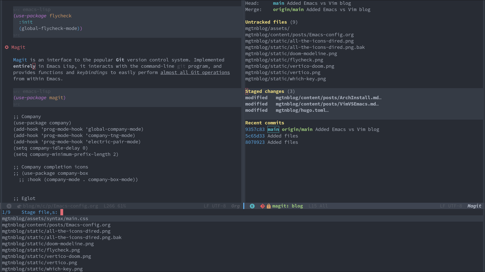

``` lisp
(use-package magit
  :custom
  (custom-set-faces
     '(magit-diff-hunk-heading-highlight ((t (:background "#282c34"))))
     '(magit-diff-context-highlight ((t (:background "#3e4452"))))))
```

## Company-mode

[Company mode](https://github.com/company-mode/company-mode) is a **text
completion framework** for GNU Emacs. It uses several back- and
front-ends to fetch and display completion candidates, respectively. The
backends include *files*, *keywords*, etc. Company mode can be
<u>integrated</u> with **LSP clients** such as *LSP-Mode* and
*Eglot* to provide **autocomplete** features through a *language
server*.

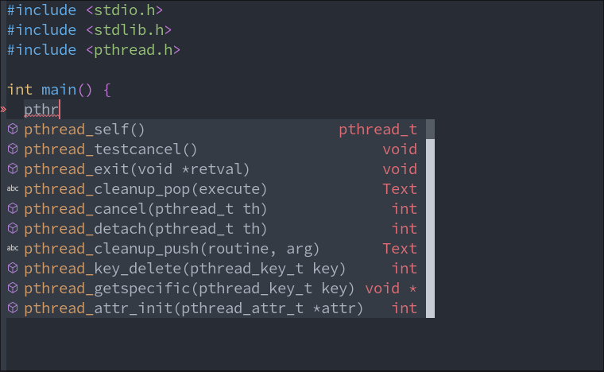

``` lisp
(use-package company
  :hook
  (prog-mode . global-company-mode)
  (prog-mode . company-tng-mode)
  (prog-mode . electric-pair-mode)
  (org-src-mode . company-mode)

  :config
  (setq company-idle-delay 0
        company-minimum-prefix-length 2)

  :custom
  (custom-set-faces
   '(company-tooltip ((t (:background "#3e4452"))))
   '(company-tooltip-selection ((t (:background "#454c59"))))
   '(company-tooltip-common ((t (:background "#3e4452"))))
   '(company-scrollbar-bg ((t (:background "#282c34"))))))
```

## LSP Mode & LSP-UI

[LSP Mode](https://emacs-lsp.github.io/lsp-mode/) is an Emacs client for
the Language Server Protocol, enhancing the **IDE experience** by
integrating with popular Emacs packages for features like <u>code
completion</u>, <u>diagnostics</u>, and navigation. It
supports real-time diagnostics/linting, code **actions**, *outline*,
*navigation*, *formatting*, *project errors* on the modeline,
**debugging**, and more, enhancing the development workflow in Emacs .

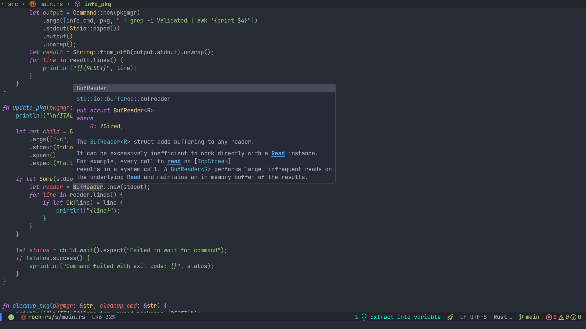

``` lisp
(use-package lsp-mode
  :defer t
  :hook (python-mode . lsp)
  :hook (c-mode . lsp)
  :hook (c++-mode . lsp)
  :hook (rust-mode . lsp)
  :hook (ess-mode . lsp)
  :hook (go-mode . lsp)
  :config
  (setq lsp-auto-guess-root t)
  (defvar lsp-modeline-code-actions-segments '(count icon name)))
```

``` lisp
(use-package lsp-ui
  :commands lsp-ui-mode
  :custom
  (custom-set-faces
   '(lsp-ui-doc-header ((t :foreground "#abb2bf" :background "#454c59"))))

  :config
  (setq lsp-ui-doc-header t)
  (setq lsp-ui-doc-include-signature t)
  (setq lsp-ui-doc-border "#e06c75")
  (setq lsp-ui-doc-show-with-cursor t)
  (setq lsp-ui-doc-position 'at-point)
  (setq lsp-ui-sideline-show-symbol t))
```

## Treemacs

[Treemacs](https://github.com/Alexander-Miller/treemacs) is a
<u>file</u> and <u>project explorer</u> for Emacs, similar
to NeoTree or Vim's NerdTree. It presents the **file system outlines**
of projects in a *tree layout*, facilitating quick navigation and
exploration. It supports basic <u>file management</u> utilities
and offers features like **displaying tags** contained in files,
location awareness, optional fontifying of files based on their git
status, and asynchronous operations for performance.

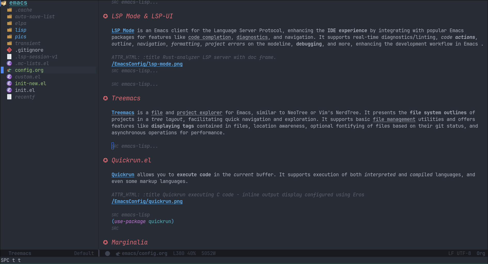

``` lisp
(use-package treemacs
  :init
  (treemacs-project-follow-mode)
  :config
  (defvar treemacs--project-follow-delay 0.2))
(use-package lsp-treemacs)
```

## Quickrun.el

[Quickrun](https://github.com/emacsorphanage/quickrun) allows you to
**execute code** in the *current* buffer. It supports execution of both
*interpreted* and *compiled* languages, and even some markup languages.

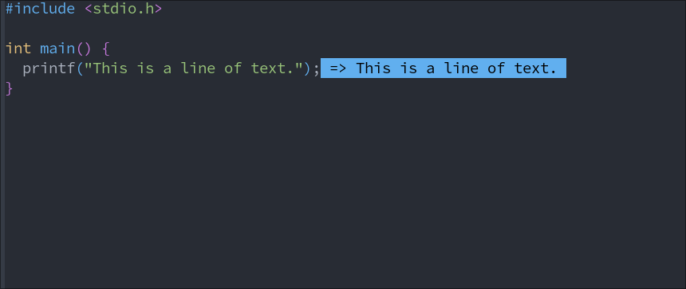

``` lisp
(use-package quickrun)
```

## Marginalia

[Marginalia](https://github.com/minad/marginalia) mode in Emacs adds
<u>colorful annotations</u> to the **minibuffer completions**,
enhancing the user experience by providing additional context or
information next to completion candidates. These annotations are based
on the *completion* category, such as file or command. Marginalia is
designed to work with various completion UIs and can be configured for
*richer annotations*, making it a valuable tool for improving the
<u>efficiency</u> and <u>clarity</u> of Emacs' minibuffer
interactions.

``` lisp
(use-package marginalia
  :after vertico
  :config
  (marginalia-mode))
```

## Org mode collection - Org mode, Org-modern

[Org mode](https://orgmode.org) is a powerful tool built into GNU Emacs
that functions like a **markup language**, helping you maintain notes,
TODO lists, etc. The simple language makes it trivial to **structure**
and **organize** documents. The language is **specific** to Emacs, and
is used extensively in <u>literate programming</u> and scientific
research. This document is written in Org itself, and it includes markup
and **code blocks**, which can be executed directly from within Emacs.

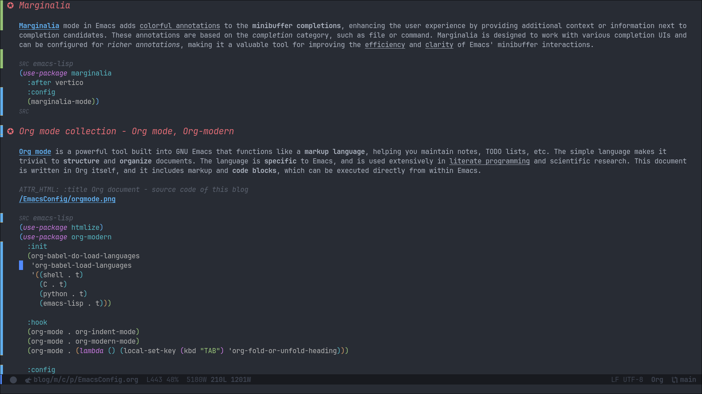

``` lisp
(use-package htmlize)
(use-package org-modern
  :init
  (org-babel-do-load-languages
   'org-babel-load-languages
   '((shell . t)
     (C . t)
     (python . t)
     (emacs-lisp . t)))

  :hook
  (org-mode . org-indent-mode)
  (org-mode . org-modern-mode)
  (org-mode . (lambda () (local-set-key (kbd "TAB") 'org-fold-or-unfold-heading)))

  :config
  (declare-function org-export-to-file "org-mode")
  (setq browse-url-browser-function 'eww-browse-url)
  (setq org-modern-star '("✪" "✪" "✪" "✪" "✪"))
  (setq org-src-preserve-indentation nil
      org-src-tab-acts-natively t
      org-edit-src-content-indentation 0
      org-confirm-babel-evaluate nil
   org-startup-indented t
      org-hide-emphasis-markers t)

  :custom
  (custom-set-faces
   '(org-level-1 ((t (:inherit outline-1 :height 1.30))))
   '(org-level-2 ((t (:inherit outline-2 :height 1.25))))
   '(org-level-3 ((t (:inherit outline-3 :height 1.20))))
   '(org-level-4 ((t (:inherit outline-4 :height 1.15))))
   '(org-level-5 ((t (:inherit outline-5 :height 1.10))))
   '(org-level-6 ((t (:inherit outline-6 :height 1.05))))
   '(org-level-7 ((t (:inherit outline-7 :height 1.00))))))
```

## Helpful

[Helpful](https://github.com/Wilfred/helpful) is an Emacs package that
**enhances** the builtin help menu in Emacs, by providing **more
contextual** info, such as *function signature*, *documentation*,
*keybindings*, etc.

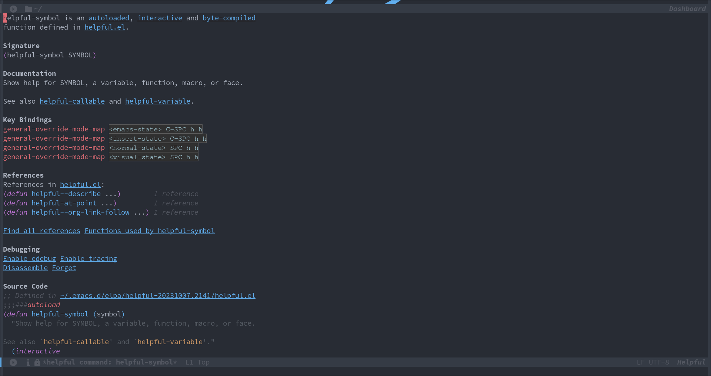

``` lisp
(use-package helpful)
```

## Rainbow delimiters

[Rainbow delimiters](https://github.com/Fanael/rainbow-delimiters)
provides a mode that **highlights delimiters**, such as "()" and
"[]", according to their *depth*. This makes it easy to spot
**matching parentheses**, brackets, etc.

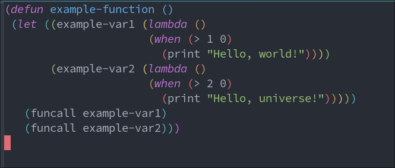

``` lisp
(use-package rainbow-delimiters)
(add-hook 'prog-mode-hook 'rainbow-delimiters-mode)
```

## Tree-sitter

[This](https://github.com/emacs-tree-sitter/elisp-tree-sitter) package
integrates Emacs and [Tree-sitter](https://tree-sitter.github.io), an
*incremental parsing* library. It provides faster and fine-grained
**syntax highlighting** in Emacs, along with *syntax trees* for source
code.

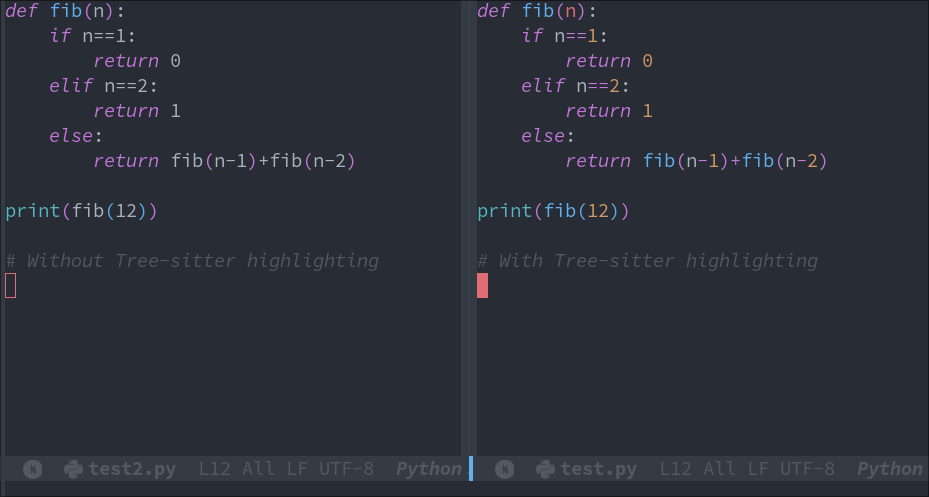

``` lisp
(use-package tree-sitter-langs)
(use-package tree-sitter
  :hook
  (tree-sitter-mode . tree-sitter-hl-mode)
  (python-mode . tree-sitter-mode)
  (sh-mode . tree-sitter-mode))
```

## Dashboard.el

[Dashboard](https://github.com/emacs-dashboard/emacs-dashboard) is an
package that provides a customizable **startup screen** for GNU Emacs.
It can be configured to show agenda items, bookmarks, *recently modified
files*, etc.

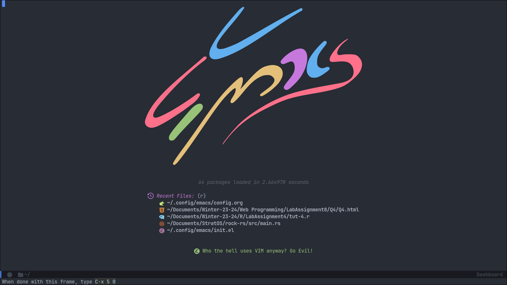

``` lisp
(use-package dashboard
    :config
        (dashboard-setup-startup-hook)
    :custom
        (dashboard-banner-logo-title nil)
        (dashboard-startup-banner "~/.config/emacs/pics/onedark_logo.svg")
        (dashboard-center-content t)
        (dashboard-display-icons-p t)
        (dashboard-set-heading-icons t)
        (dashboard-icon-type 'nerd-icons)
        (dashboard-set-file-icons t)
        (dashboard-items '((recents . 5))))
(require 'dashboard-widgets)
```

## Diff-HL

[Diff-HL](https://github.com/dgutov/diff-hl) is a package for GNU Emacs
that provides a mode for **highlighting uncommitted changes** in
version-control systems such as Git, Mercurial, etc. These are displayed
in the *gutter* region of the Emacs window.

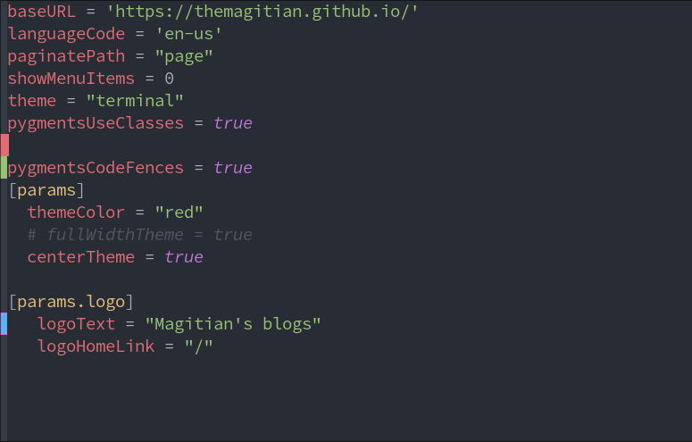

``` lisp
(use-package diff-hl
  :init
  (global-diff-hl-mode 1)
  (diff-hl-flydiff-mode)

  :custom
  (custom-set-faces
   '(diff-hl-change ((t (:background "#61afef"))))
   '(diff-hl-insert ((t (:background "#97c277"))))
   '(diff-hl-delete ((t (:background "#e06c75")))))

  :hook
  (prog-mode . diff-hl-mode)
  (magit-pre-refresh . diff-hl-magit-pre-refresh)
  (magit-post-refresh . diff-hl-magit-post-refresh))
```

## Consult

[Consult](https://github.com/minad/consult) is an Emacs package that
provides commands to **enhance** the user's interaction with the
*minibuffer*. It supports **live-previews** for currently open buffers,
search within buffers, files, etc.

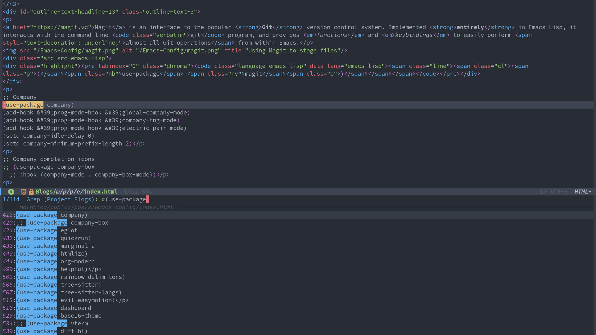

``` lisp
(use-package consult)
```

## Orderless

[Orderless](https://github.com/oantolin/orderless) provides a completion
style with higher *control* and *flexibility* over **completion**, than
that provided by default in GNU Emacs. I've configured it to make
*file* autocompletion find **partial** matches.

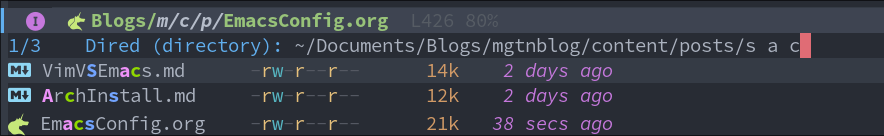

``` lisp
(use-package orderless
  :ensure t
  :custom
  (completion-styles '(orderless basic))
  (completion-category-overrides '((file (styles basic partial-completion)))))
```

## Eros

[Eros](https://github.com/xiongtx/eros), short for `E`valuation `R`esults `O` verlay `S`,
displays results from **evaluating Emacs Lisp** code inside a *temporary
annotation* within the buffer. This is useful to display the **output**
of code execution without having to switch to a *scratch* buffer. The
below code configures **Quickrun** to be a backend for Eros, which
enables it to display the output of code executed in various languages.

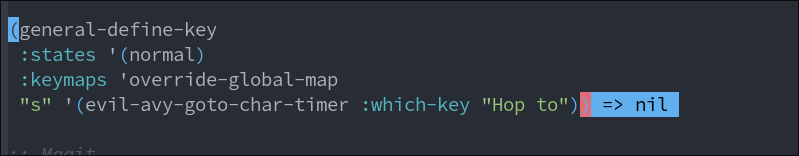

``` lisp
(use-package eros
  :init (eros-mode 1)
  :after quickrun
  :config (setq quickrun-focus-p nil)
  :custom
  (custom-set-faces
   '(eros-result-overlay-face ((t (:foreground "#000000" :background "#61afef"))))
   '(eros-eval-overlay-face ((t (:background "#61afef" :foreground "#97c277")))))) ; not sure what this line does

  :hook
  (quickrun-after-run . eros-quickrun-show-overlay)
  (quickrun-after-run . clear-eros-overlays)
  (quickrun-after-run . quickrun-hide-window-after-execution)

(require 'quickrun)
(require 'eros)
```

## Vterm collection - Vterm & Vterm-toggle

[Vterm](https://github.com/akermu/emacs-libvterm) is a **terminal
emulator** in Emacs based on libvterm, offering a **fast** and capable
terminal experience with *seamless* handling of large outputs. It
integrates with Emacs, allowing for running **interactive programs** and
executing Emacs functions from within the terminal. However, it's **not
available** on Windows and requires Emacs to be compiled with module
support.

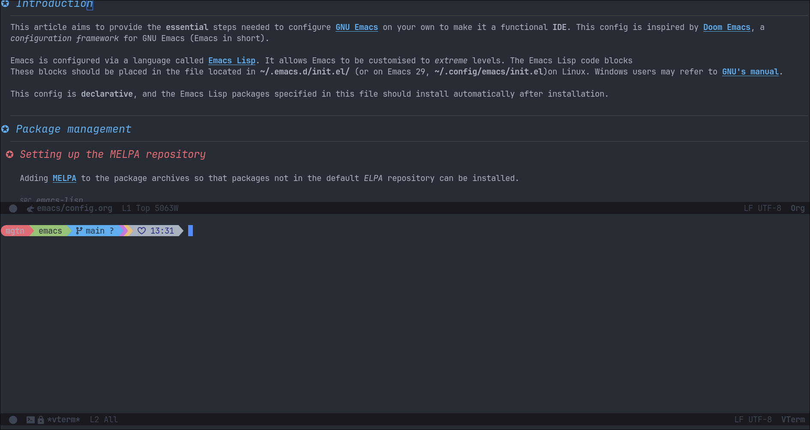

``` lisp
(use-package vterm-toggle
  :requires vterm
  :config
  (setq vterm-min-window-width 30)
  (setq vterm-toggle-fullscreen-p nil)
  (add-to-list 'display-buffer-alist
             '((lambda (buffer-or-name _)
                   (let ((buffer (get-buffer buffer-or-name)))
                     (with-current-buffer buffer
                       (or (equal major-mode 'vterm-mode)
                           (string-prefix-p vterm-buffer-name (buffer-name buffer))))))
                (display-buffer-reuse-window display-buffer-at-bottom)
                (reusable-frames . visible)
                (window-height . 0.35))))
```

## Togetherly

[Togetherly](https://github.com/zk-phi/togetherly) enables
**collaborative editing** by allowing multiple clients to edit a <u>single
buffer</u> online. It facilitates *real-time* collaboration by
acting as a server for sharing buffers and as a client for connecting to
shared buffers.

``` lisp
(use-package togetherly)
```

## Rust-mode

[Rust-mode](https://github.com/rust-lang/rust-mode) is an Emacs package
designed to *enhance* the experience of **editing Rust code** by
providing <u>syntax highlighting</u>, *indentation*, and
integration with *Cargo*, Rust's package manager, and tools like
**clippy** and **rustfmt**. It requires Emacs 25 or later and is
included by default in Emacs Prelude and Spacemacs.


``` lisp
(use-package rust-mode)
```

## Emacs Speaks Statistics (ESS)

Emacs Speaks Statistics
([ESS](https://ess.r-project.org/Manual/ess.html)) is an Emacs package
that provides a **unified interface** for interacting with various
statistical analysis packages, including R, SAS, BUGS/JAGS, Stata, and
Julia. ESS *enhances* the editing experience with features like <u>command
history</u>, <u>command-line completion</u>, and easy
access to <u>help</u> files.

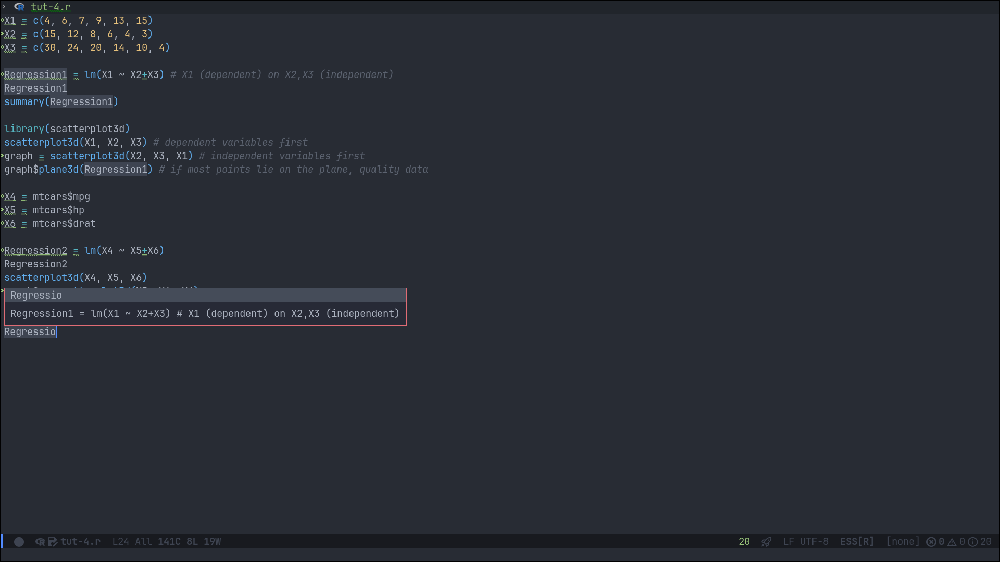

``` lisp
(use-package ess
 :config
 (setq ess-eval-visibly nil)
 (setq ess-R-font-lock-keywords
  '((ess-R-fl-keyword:keywords . font-lock-keyword-face)
   (ess-R-fl-keyword:constants . font-lock-constant-face)
   (ess-R-fl-keyword:modifiers . font-lock-builtin-face)
   (ess-R-fl-keyword:fun-defs . font-lock-function-name-face)
   (ess-R-fl-keyword:assign-ops . font-lock-variable-name-face)
   (ess-R-fl-keyword:%op% . font-lock-type-face)
   (ess-fl-keyword:fun-calls . font-lock-function-name-face)
   (ess-fl-keyword:numbers . font-lock-constant-face)
   (ess-fl-keyword:operators . font-lock-builtin-face)
   (ess-fl-keyword:delimiters . font-lock-delimiter-face)
   (ess-fl-keyword:= . font-lock-builtin-face)
   (ess-R-fl-keyword:F&T . font-lock-warning-face))))
```

## Impatient-mode

[Impatient Mode](https://github.com/skeeto/impatient-mode) is an Emacs
package that allows for *real-time* HTML development by **automatically
refreshing** your browser as you edit your HTML files in Emacs. It works
by starting a <u>local web server</u> and serving the document
you are editing to your browser, providing **immediate feedback** on
your changes.

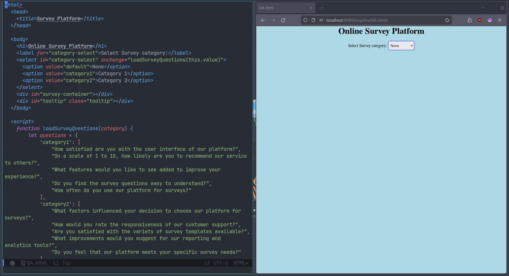

``` lisp
(use-package impatient-mode
  :hook
  (html-mode . start-httpd-server-browser)
  (css-mode  . start-httpd-server-browser))
```

## Undo-tree

[Undo-tree](https://elpa.gnu.org/packages/undo-tree.html) is an Emacs
package that *enhances* the <u>undo functionality</u> by treating
undo history as a **branching tree** of changes, similar to how Vim
handles undo/redo. This approach makes it easier to *navigate* through
the undo history, allowing users to undo or redo any change while
**preserving the entire history** of past states.

``` lisp
(use-package undo-tree
  :init
  (global-undo-tree-mode 1)
  :config
  (setq undo-tree-auto-save-history nil)
  (define-key evil-normal-state-map "u" 'undo-tree-undo)
  (define-key evil-normal-state-map "\C-r" 'undo-tree-redo))
```

## Multiple-cursors

Multiple Cursors is an Emacs package that allows users to have
**multiple cursors** in a buffer, enabling them to edit multiple lines
*simultaneously*. This functionality is particularly useful for tasks
such as editing <u>multiple lines</u> of code or text in a
**single** operation.

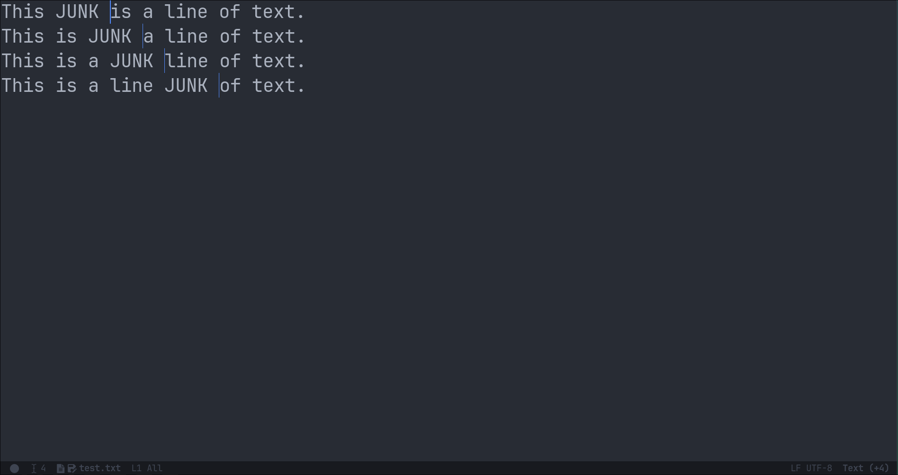

``` lisp
(use-package multiple-cursors
  :init
  (setq mouse-1-click-follows-link nil)
  (define-key global-map [down-mouse-1] 'mouse-set-point)
  (define-key global-map [mouse-1] 'mouse-set-point)
  (define-key global-map (kbd "M-<down-mouse-1>") 'mc/add-cursor-on-click))
```

------------------------------------------------------------------------

# Functions

These are some functions for QoL and a few keybindings.

``` lisp
(defun write-and-quit()
  "Write contents of buffer and quit Emacsclient window."
  (interactive)
  (save-some-buffers t)
  (kill-emacs))
```

``` lisp
(defun toggle-mc-multiple-cursors ()
  "Toggle multiple cursors."
  (interactive)
  (mc/keyboard-quit))
```

``` lisp
(defun scratch ()
  "Create a new scratch buffer to work in - (could be *scratch* - *scratchX*)."
  (interactive)
  (let ((n 0)
        bufname)
    (while (progn
             (setq bufname (concat "*scratch"
                                   (if (= n 0) "" (int-to-string n))
                                   "*"))
             (setq n (1+ n))
             (get-buffer bufname)))
 (switch-to-buffer (get-buffer-create bufname))
 (if (= n 1) initial-major-mode))) ; 1, because n was incremented

(with-current-buffer (get-buffer-create "*dashboard*") (emacs-lock-mode 'kill))
```

``` lisp
(defun kill-other-buffers ()
  "Keep only the current buffer, scratch, and dashboard buffers, kill all others."
  (interactive)
  (httpd-stop)
  (let ((buffers-to-keep '("*scratch*" "*dashboard*"))
        (current-buffer-name (buffer-name)))
    (mapc (lambda (buffer)
            (unless (or (member (buffer-name buffer) buffers-to-keep)
                        (equal (buffer-name buffer) current-buffer-name))
              (kill-buffer buffer)))
          (buffer-list)))
  (message "Killed other buffers"))
```

``` lisp
(defun org-html-export-to-html-and-open ()
  "Export the Org file to HTML and open it in EWW."
  (interactive)
  (let* ((org-file (buffer-file-name))
         (html-file (concat (file-name-sans-extension org-file) ".html"))
         (html-file-url html-file))
    (org-export-to-file 'html html-file nil nil nil nil)
 ;; (split-window-left)
 ;; (evil-window-vsplit)
    (eww-open-file html-file-url)))
```

``` lisp
(defun clear-recent-files ()
  "Clear list of recent files displayed in Dashboard."
  (interactive)
  (setq recentf-list nil)
  (dashboard-open))
```

``` lisp
(defun delete-current-buffer-file ()
  "Delete the current file and buffer, but only if the user confirms."
  (interactive)
  (when (buffer-file-name)
 (when (yes-or-no-p (concat "Are you sure you want to delete " (buffer-file-name) "?"))
      (delete-file (buffer-file-name))
      (kill-buffer))))
```

``` lisp
(defun clear-eros-overlays ()
  "Function to clear Eros overlays."
  (interactive)
  (remove-overlays (point-min) (point-max)))
```

``` lisp
(defun quickrun-hide-window-after-execution ()
  "Hide Quickrun window after execution."
  (interactive)
  (let ((win (get-buffer-window "*quickrun*")))
    (when win
      (delete-window win))))
```

``` lisp
(defun eros-quickrun-show-overlay ()
  "Display an overlay with result of Quickrun execution."
  (interactive)
  (eros-mode -1)
  (eros-mode 1)
  ;; (kill-buffer "*quickrun*")
  ;; (generate-new-buffer "*quickrun*")
  (when (and quickrun--timeout-timer
             (not (equal quickrun--timeout-timer 'ignore)))
    (cancel-timer quickrun--timeout-timer))
  (setq quickrun--timeout-timer
        (run-at-time 0.5 nil
                     (lambda ()
                       (let ((output (with-current-buffer quickrun--buffer-name
                                       (buffer-substring-no-properties (point-min) (point-max)))))
                         (with-current-buffer (window-buffer (selected-window))
                           (condition-case nil
                               (eros--make-result-overlay output)
                             (error (message "Error creating Eros overlay")))
                           (with-current-buffer quickrun--buffer-name
                             (let ((inhibit-read-only t))
                               (erase-buffer)))))))))
```

``` lisp
(defun evaluate-buffer ()
 "Evaluate the current buffer."
 (interactive)
 (if (eq major-mode 'emacs-lisp-mode)
   (let ((result (eval-buffer)))
     (unless (null result)
       (eros--make-result-overlay result)))
 (quickrun)))
```

``` lisp
(defun start-httpd-server-browser ()
  "Start httpd server and open browser."
  (interactive)
  (impatient-mode)
  (httpd-start)
  (browse-url-generic (concat "http://localhost:8080/imp/" )))
```

``` lisp
(defun edit-config-file ()
  "Edit Emacs's init.el."
  (interactive)
  (find-file "~/.config/emacs/init.el"))
```

``` lisp
(defun evaluate-region ()
 "Evaluate the selected region."
 (interactive)
 (if (use-region-p)
 (if (eq major-mode 'emacs-lisp-mode)
     (let ((result (eros-eval-last-sexp (sexp-at-point))))
       (unless (null result)
         (eros--make-result-overlay result)))
   (let ((result (quickrun-region (region-beginning) (region-end))))
     (unless (null result)
       (eros--make-result-overlay result))))
 (quickrun)))
```

``` lisp
(defun org-enter-maybe-execute-code ()
  "Execute source code blocks with Enter in Org mode."
 (interactive)
 (if (org-in-src-block-p)
     (org-babel-execute-src-block)
   (evil-ret)))
```

------------------------------------------------------------------------

# Conclusion

This is, *by no stretch of imagination*, an exhaustive list of Emacs
packages. This configuration is merely a **starting point**. Being
[highly] <u>customizable</u>, you may continue to **explore**,
**adapt** and create an *environment* that best suites your workflow.

------------------------------------------------------------------------

# Footnotes

[^1]: <https://magit.vc/manual/magit.html>
