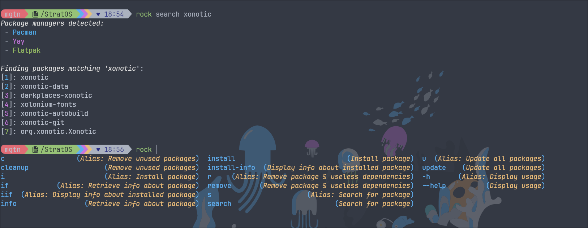

> # <u>**Srinath Anand**</u>
> **Junior, VIT Chennai**
>
> **Technical Advisor, [Linux Users Group](https://lugvitc.net/), VIT Chennai**

-----
## <u>PROFILE</u>
> Passionate about GNU/Linux.
>
> Analytical thinker, problem-solver,
>
> Tech enthusiast, open-source programmer.

-----
## <u>EDUCATION</u>

| Institution                                                           | Academic Term | Course             | Grade      |
|-----------------------------------------------------------------------|---------------|--------------------|------------|
| [Vellore Institute of Technology, Chennai](https://chennai.vit.ac.in) | 2022-26       | B. Tech CSE (Core) | CGPA: 8.71 |
| [National Public School, Gopalapuram](https://npschennai.com)         | 2010-22       | AISSCE             | 94.2%      |
| [National Public School, Gopalapuram](https://npschennai.com)         | 2010-22       | AISSE              | 94%        |

-----
## <u>PROJECTS</u>

### [StratOS Linux](https://stratos-linux.github.io): 

> A GNU/Linux _distribution_ based on [Arch Linux](https://archlinux.org). It provides access to
> the *largest set* of repositories of software available on _any_ Linux distribution.
> My twin (and fellow VITian) Srikanth and I **develop** the distribution and <u>maintain
> the package repository</u>, fixing bugs in the distribution.

### [Rockers](https://github.com/stratos-linux/rockers):
> Implemented this meta-package manager in <u>Rust</u>, for managing packages
> across **several** Linux distributions _and_ repositories.

### Smart Planner:
> A **voice assistant** we worked on as a team to aid with <u>calendar-
> based task scheduling</u> using a *Raspberry Pi*, *ESP8266*, *Arduino Uno* and MQTT,
> Python & **natural-language processing** to parse voice commands, using <u>Firebase</u> as a database and a
> *ReactJS* frontend I helped develop.

### [Dijkstra](https://gitlab.com/magitian/dijkstra/):
> I created this to <u>visualize</u> the effects of _applying_ Dijkstra's and A*
> algorithms on a Matplotlib graph. By measuring the **execution time** between the
> two, their **efficiency** is determined in various scenarios.

### [Terminator](https://gitlab.com/magitian/tui-process-manager):
> A proof-of-concept task manager written in C using Ncurses. It
> updates the processes list on-the-fly and sends different UNIX signals to them.

---
## <u>SKILLS</u>

<u>Programming Languages/Frameworks:</u>

|         |       |            |               |
|---------|-------|------------|---------------|
| Python  | C/C++ | Rust       | NumPy/Jupyter |
| Java    | R     | JavaScript | Bash          |
| ReactJS | SQL   | Matplotlib | Ncurses       |
|         |       |            |               |

<u>Tools:</u>

|           |                     |           |          |
|-----------|---------------------|-----------|----------|
| GNU/Linux | Docker              | Git       | GitHub   |
| GNU Emacs | Cisco Packet Tracer | Wireshark | Firebase |
| Arduino   | Raspberry Pi        | MQTT      | PyPI     |
|           |                     |           |          |
