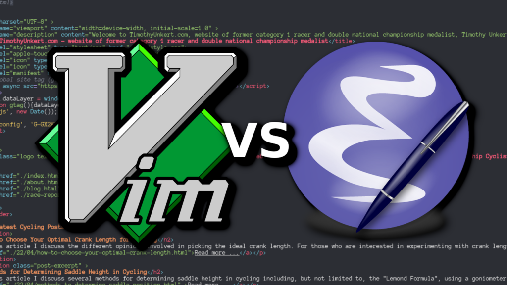
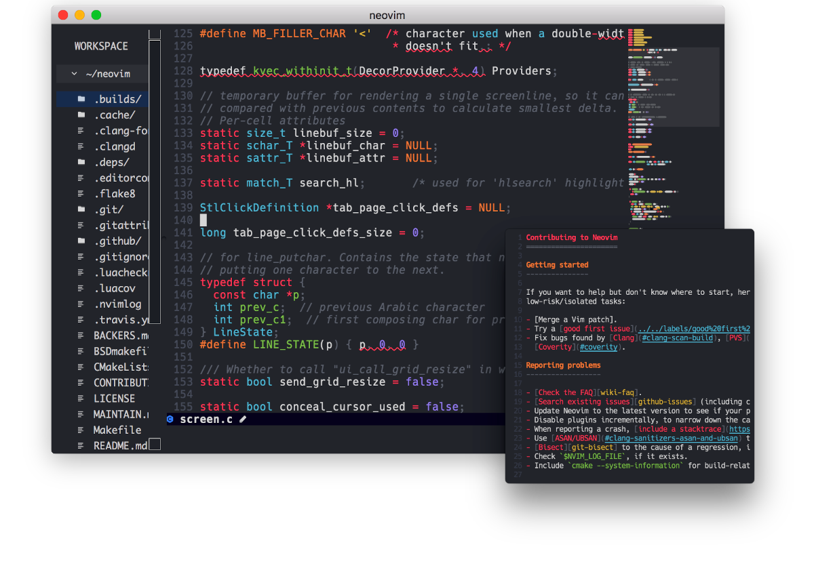
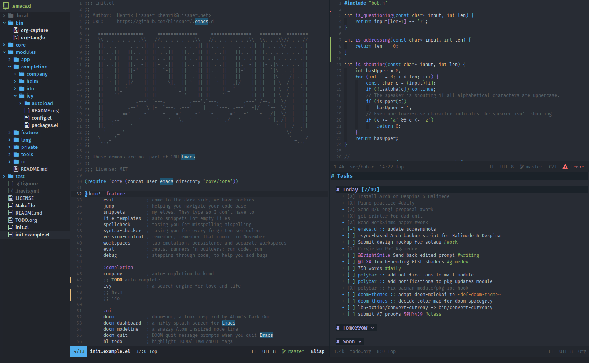
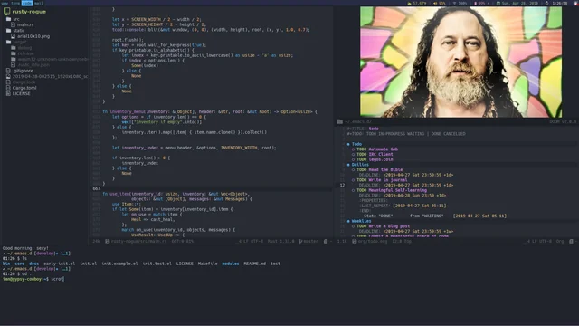

This is an overview of the two FOSS text editors  - **Vim** (Neovim) and **GNU Emacs**. 

The battle between these editors, and as a result, between the fans of the two, has become pervasive in the _free software_ community - it was preceded by the Vim/Emacs battle.  Fans of either editor go to great lengths to establish the supremacy of their editor of choice. This article does not seek to provide _a definitive answer_ about the better of the two - that's the reader's discretion.

Both are *highly customizable* editors, and can be transformed into *complete* development environments. They are primarily used for editing source code, although they are just as good for writing novels and articles (such as this one :wink: ). The time one invests in these editors is almost proportional to the product, as these environments are often very **sophisticated**; developers often use Neoim/Emacs instead of professional (which is almost synonymous with _proprietary_, if it were not for these two, and VS Code) development environments. 

**NOTE**:  to make the comparisons fair, the features of Neovim, a fork of Vim that sees more community-led development, not present in Vim _may_ be included. These would be mentioned as features of Neovim, and not Vim, although they are different text editors.

---
# History
---
## Vim
The history of Vim is rich, with its origins tracing back to the 1980s. Vim's forerunner, Stevie (ST Editor for VI Enthusiasts), was created by Tim Thompson for the Atari ST in 1987.

[Stevie](https://en.wikipedia.org/wiki/Stevie_(text_editor)) was one of the first popularized clones of Vi, and it did not use Vi's source code. The source code for Vi used the Ed text editor developed under AT&T, and therefore Vi could only be used by those with an AT&T source license. This limitation led to the development of Vim, which was based on the source code for Stevie. This allowed the program to be distributed without requiring the AT&T source license [en.wikipedia.org](https://en.wikipedia.org/wiki/Vim_(text_editor)).

[Bram Moolenaar](https://en.wikipedia.org/wiki/Bram_Moolenaar), the creator of Vim, began working on Vim for the Amiga computer in 1988, with the first public release (Vim v1.14) in 1991. At the time of its first release, the name "Vim" was an acronym for "Vi IMitation", but this changed to "Vi iMproved" late in 1993.

## Neovim
[Neovim](https://neovim.io), often referred to as Nvim, is a highly extensible text editor that was initiated by Thiago de Arruda in 2011 as a fork of Vim. The creation of Neovim aimed to overcome Vim's limitations, such as difficulty in extending and customizing the text editor. Neovim has evolved into a robust and adaptable text editor, inheriting many features from its predecessor, Vim, while adding enhancements and improving usability

## GNU Emacs
[EMACS](https://en.wikipedia.org/wiki/Emacs) was a family of text editors. Initially signifying **E**ditor **MAC**ro**S**, the family was renowned for their extensibility. The [GNU Emacs](https://www.gnu.org/software/emacs/) text editor was created by [Richard Stallman](https://en.wikipedia.org/wiki/Richard_Stallman), a famous computer scientist and _free software_ proponent, and the founder of the [**GNU** Project](https://gnu.org)/ to be an open-source alternative to the **proprietary** EMACS versions. Interestingly, it remains among the oldest FOSS projects under _active_ development.

---
# Design
---

## Neovim
Neovim, like Vim, is designed to be a terminal-based code editor -  fast and small, which is a key factor in its performance and efficiency. A terminal interface (either a terminal emulator, or the TTY on Linux) is required to run Neovim, although several GUI frontends exist. It's built with a modular architecture, which makes it easier to add new features and improvements. This design also allows for a more powerful plugin architecture, with the ability to manage plugins more efficiently.

Neovim's key-based editing is a fundamental aspect of its design philosophy, which is centered around efficient text manipulation. Vim operates in different modes, including "normal mode" for navigating and manipulating text, and "insert mode" for inserting new text. To enter normal mode in Vim, you can press the Esc key on your keyboard, which will allow you to enter commands and navigate the text. There are multiple ways to enter insert mode in Vim, for example, you can press the 'i' key while in normal mode. This will allow you to insert text at the current cursor position

One of the key differences between Vim and Neovim is in their extensibility. Vim's core is more **complicated** and **interwoven**, making it challenging to add additional features. On the other hand, Neovim is very expandable and modular, which makes it easier to add new features and improvements).

Neovim also offers a more **powerful plugin architecture**. The abundance of _plugin managers_ in Neovim makes managing plugins much simpler. Neovim's remote plugin design enables the editor to increase its capabilities by making remote procedure calls. With this **asynchronous plugins support**, any programming language, such as Lua, Python,etc.  may be used to make these calls asynchronously.

## GNU Emacs
GNU Emacs, on the other hand, is a highly customizable **GUI** text editor that was first implemented at the Artificial Intelligence Laboratory at MIT in 1976. In 1984, Richard Stallman, the main author of the original TECO Emacs, wrote the first GNU Emacs. This version of Emacs was written in the **LISP programming language**, which provided more _extensibility_ than ever before and has been followed by most subsequent versions of Emacs.

GNU Emacs uses a system of keymaps to bind keys to commands. Keymaps are data structures that record the bindings between key sequences and command functions. The global keymap is always in effect and defines keys for Fundamental mode, which are common to most or all major modes. Each major or minor mode can have its own keymap which overrides the global definitions of some keys.

A **prefix key** is a key that is part of a key sequence which is used to initiate a command. For example, in the key sequence `C-x C-s`, `C-x` is the prefix key. Each prefix key has its own keymap, which holds the definition for the event that immediately follows that prefix [emacsdocs.org](https://emacsdocs.org/docs/emacs/Prefix-Keymaps).

A **modifier** in Emacs is a key that changes the meaning of the key that follows it. For example, in the key sequence `C-x`, `C` is a modifier key that changes the meaning of `x`. Modifiers include `C` for Control, `M` for Meta (usually the Alt key on most keyboards), and `S` for Shift [masteringemacs.org](https://www.masteringemacs.org/article/mastering-key-bindings-emacs).

The `C` and `M` are used to denote Control and Meta modifiers respectively. For example, in the keybinding `C-x`, `C` stands for Control and `x` is the key that is being modified by the Control key. Similarly, in the keybinding `M-x`, `M` stands for Meta and `x` is the key that is being modified by the Meta key [masteringemacs.org](https://www.masteringemacs.org/article/mastering-key-bindings-emacs)

Emacs is known for its extensive **customizability** and extensibility. It has a built-in **help** library that includes documentation for every _command_, _variable_, and _internal function_, making it a **self-documenting** editor. It also has a built-in tutorial and can be extended with Lisp programs to adapt its behavior for different types of text.

The core functionality is handled apart from the UI (via _Emacs Lisp_), meaning that Emacs can be **embedded** into any other GUI system.

---
# Features
---

## Neovim
Neovim, a fork of Vim, has several unique features that set it apart from other text editors:

1. **Built-in Language Server Protocol (LSP)**: Neovim comes with a built-in LSP, which allows it to provide features like autocompletion, go-to-definition, and error highlighting for many programming languages.

2. **Tree-sitter**: Neovim includes native support for Tree-sitter, which allows it to parse code and provide syntax highlighting and indentation in a more accurate and efficient manner.

3. **Asynchronous Plugin Support**: Neovim supports asynchronous plugins, which means that plugins can perform tasks without blocking the editor's user interface. This feature makes Neovim more responsive and efficient.

4. **First-class Modal Editing**: Neovim supports modal editing, a feature inherited from Vim's predecessor, Vi. This allows users to switch between different editing modes, such as command mode and insert mode, which can improve productivity and efficiency.

5. **Modern Code Base**: Neovim is built with a modern code base that is easier to extend and customize than Vim's.

6. **Fast Startup**: Neovim is known for its fast startup time. A new Neovim instance can start almost instantly, which is particularly useful when working with multiple files or projects.

7. **Low Memory Usage**: Neovim is also light on memory usage. This allows you to have multiple Neovim instances open at the same time without consuming a lot of system resources.

8. **UI Agnostic**: Neovim is designed to be UI agnostic. This means that it can be embedded into any other GUI system, such as Atom, making it highly adaptable.

9. **Terminal User Interface (TUI) Support**: Neovim can work in a terminal, on a remote server over SSH, or as a GUI application. This flexibility makes Neovim a versatile tool that can be used in various environments.

## GNU Emacs

GNU Emacs, on the other hand, has several unique features that set it apart from other text editors:

1. **Extensibility with Emacs Lisp**: Emacs is highly extensible and customizable, thanks to its built-in scripting language, Emacs Lisp. This allows users to modify almost any aspect of Emacs' behavior and appearance.

2. **Self-Documenting**: Emacs is designed to be self-documenting. Every variable or function has some documentation, and this documentation is searchable through the completion UI. This feature makes Emacs easier to learn and use.

3. **Built-in Package Manager**: Emacs comes with a built-in package manager, which makes it easy to add new features and customizations.

4. **Variety of Modes**: Emacs has modes for nearly every use case, even ones like mail and internet browsing. It's often been said that Emacs is essentially an operating system on its own.

5. **Vim Emulation**: Emacs includes [Evil mode](https://github.com/emacs-evil/evil), which provides Vim emulation. This allows Vim users to use Vim keybindings and behaviors within Emacs, making the transition to Emacs easier for Vim users.

6. **Keyboard Macros**: Emacs allows you to record a sequence of key presses and then replay it as many times as one wants. This feature can be very useful for automating repetitive tasks.

7. **Colors for Faces**: Emacs allows you to assign various foreground and background colors to "faces". This can greatly enhance the readability and aesthetics of text.

8. **Org Mode**: Org-mode is a powerful tool for note-taking and documentation. It supports a variety of formats, including plain text, HTML, LaTeX, and more. It also includes features like hyperlinks, tables, and syntax highlighting.

9.  **Magit**: Magit is a Git interface for Emacs. It provides a visual representation of your Git repositories, making it easier to navigate and manage your Git projects.  It supports all the basic Git operations, such as committing changes, creating branches, and merging. It also supports more advanced features, like rebasing and cherry-picking.

---
# Conclusion
---
In conclusion, both Neovim and GNU Emacs are **highly customizable** and **powerful** text editors that can be transformed into complete development environments. They are primarily used for editing source code, but they are also excellent tools for writing novels, articles, and more. The choice between the two often comes down to **personal preference** and the _specific needs_ of the user.

Neovim, with its modular architecture and powerful plugin architecture, offers a **fast, efficient**, and highly extensible environment. It supports modal editing, asynchronous plugins, and has a built-in Language Server Protocol, among other features.

On the other hand, GNU Emacs is known for its **extensibility** with Emacs Lisp, self-documenting nature, and variety of modes. It offers features like keyboard macros, **colors for faces**, and a built-in package manager. It also provides powerful tools like Org-mode for note-taking and documentation, and Magit for Git integration.

Both editors have their strengths and unique features that can greatly enhance a developer's **productivity**. It's recommended for users to try out both editors and see which one fits their workflow better. As these are highly customizable editors, users can tweak and configure them to their liking, making them adaptable to their specific needs.

---
# References
---
- [psakalo.substack.com](https://psakalo.substack.com/p/my-take-on-neovim-vs-emacs-vs-vs)
- [Evil mode](https://github.com/emacs-evil/evil)
- [Org mode](https://orgmode.org)
- [Neovim Treesitter - GitHub](https://github.com/nvim-treesitter/nvim-treesitter/wiki/Gallery)
- [r/unixporn post - ExistentialTowel](https://www.reddit.com/r/unixporn/comments/bi81x6/i3_learning_to_love_emacs/)
- [Banner image - Unkertmedia.com](https://unkertmedia.com/wp-content/uploads/2022/04/vim-vs-emacs-1024x576.png)
